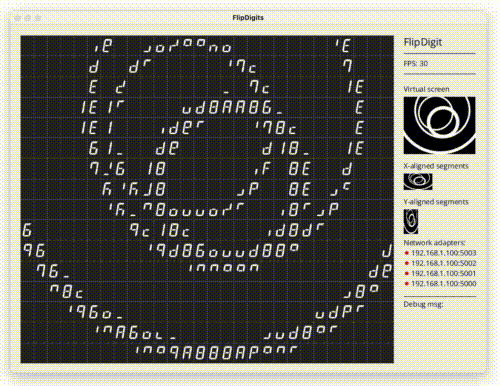

# FlipDigit kinetic display

  
Kinetic Digits, is a mechanical Flip Digit display made up of 448 7-segment digits.

## Flip Digits (XY7)
Flip Digits are electromagnetic operated 7-segments digits they can individually flip on & off creating images from a distance.

This project was heavily inspired by the works of; [Ksawery Kirklewski](https://ksawerykomputery.pl/works/flipdigits-monitor) and [Breakfast NY](https://breakfastny.com/).

This repo is the open-source Processing App that runs the graphics on a 7-segment. Here you will find everything you need to setup and run your own display.

## About the FlipDigit panels
Each digit is made up of 7 segments that each hold a permanent magnet that physically flip on or off. Powered by a small electromagnetic to change state each segment retains its state even after power is disconnected.

These XY7 panels are made by [AlfaZeta](https://flipdots.com/en/xy7-flip-digits-panels/), each panel includes a controller board that communicates over an RS485 serial connection using its own protocol. These panels have 7x4 digits, each digit is made up of 7 segments for a total of 196 'pixels' per-panel.

The panels can be daisy-chained together to share an RS485 line but only to a point. Chaining too many panels will result in slower framerates. In this setup of 16 panels, I have chained 4 panels coming from 4 serial outputs on the [ETH-UKW485SR140](http://www.sklep.uk-system.pl/konwertery-eth-ukw485sr140-z-4-portami-szeregowymi-rs485-p-41.html) Ethernet to RS485 Serial converter.

## Image Processing
To render graphics to the display I am using [Processing](https://processing.org/) a powerful Java-based software package for the visual arts.

If you know Processing or p5js you can easily draw whatever you want. It works by drawing to a virtual canvas that is processed and sent to the display.
The virtual XY pixel canvas is converted into a 7-segment digits image using a technique inspired by [Ksawery Kirklewski](https://ksawerykomputery.pl/tools/flipdigits-player) that creates two virtual images. One for all X-aligned segments and a second for all Y-aligned segments. The pixel image is scaled to fit these two axis images, processed and then combined for the resulting 7-segment image.
See [cast_convertImage()](https://github.com/owenmcateer/FlipDigits/blob/master/FlipDigits/cast.pde#L157) for where this pixel-to-segment mapping happens.

## Build list
- XY7 7-segment Flip Digit panels from [AlfaZeta](https://flipdots.com/en/xy7-flip-digits-panels/)
- Laser cut steel back plate. Design file: [pdf](https://github.com/owenmcateer/FlipDigits/blob/main/assets/Back-plate.pdf)/[dxf](https://github.com/owenmcateer/FlipDigits/blob/main/assets/Back-plate.dxf)
- 24V 16A PSU
- Ethernet to RS485 Serial converter [ETH-UKW485SR140](http://www.sklep.uk-system.pl/konwertery-eth-ukw485sr140-z-4-portami-szeregowymi-rs485-p-41.html)
- RJ11 cables
- Processing to run software

---

 
